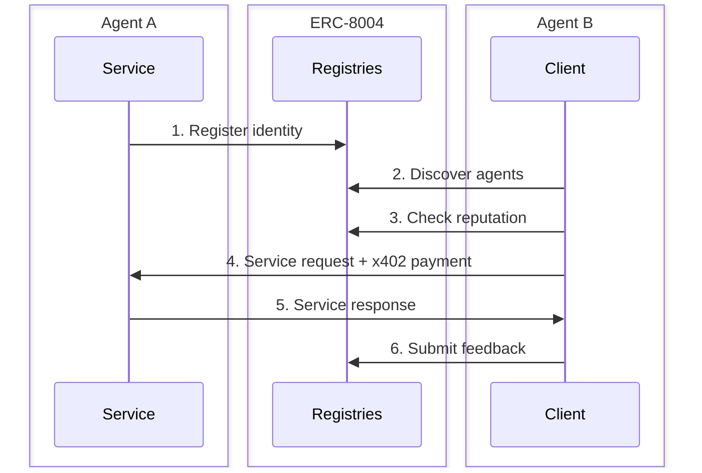

> ## Documentation Index
> Fetch the complete documentation index at: https://docs.monad.xyz/llms.txt
> Use this file to discover all available pages before exploring further.

# How to register and build with ERC-8004 (Trustless Agents) on Monad

export const CopyToClipboard = ({value, children}) => {
  const [copied, setCopied] = useState(false);
  const handleCopy = async () => {
    try {
      await navigator.clipboard.writeText(value);
      setCopied(true);
      setTimeout(() => setCopied(false), 1000);
    } catch {
      const textarea = document.createElement("textarea");
      textarea.value = value;
      textarea.style.position = "fixed";
      textarea.style.opacity = "0";
      document.body.appendChild(textarea);
      textarea.select();
      document.execCommand("copy");
      document.body.removeChild(textarea);
      setCopied(true);
      setTimeout(() => setCopied(false), 1000);
    }
  };
  return <span style={{
    display: "inline",
    whiteSpace: "nowrap"
  }}>
      {children}
      <button onClick={handleCopy} title={copied ? "Copied!" : "Copy to clipboard"} style={{
    background: "none",
    border: "none",
    cursor: "pointer",
    padding: "2px",
    display: "inline-flex",
    alignItems: "center",
    verticalAlign: "middle",
    marginLeft: "4px",
    opacity: copied ? 1 : 0.4,
    transition: "opacity 0.15s"
  }} onMouseEnter={e => {
    if (!copied) e.currentTarget.style.opacity = "0.8";
  }} onMouseLeave={e => {
    if (!copied) e.currentTarget.style.opacity = "0.4";
  }}>
        {copied ? <svg width="14" height="14" viewBox="0 0 24 24" fill="none" stroke="#22c55e" strokeWidth="2.5" strokeLinecap="round" strokeLinejoin="round">
            <polyline points="20 6 9 17 4 12" />
          </svg> : <svg width="14" height="14" viewBox="0 0 24 24" fill="none" stroke="currentColor" strokeWidth="2" strokeLinecap="round" strokeLinejoin="round">
            <rect x="9" y="9" width="13" height="13" rx="2" ry="2" />
            <path d="M5 15H4a2 2 0 0 1-2-2V4a2 2 0 0 1 2-2h9a2 2 0 0 1 2 2v1" />
          </svg>}
      </button>
    </span>;
};

This guide shows how to register AI agents and build trustless agent interactions using ERC-8004 on Monad.

## What is ERC-8004?

[ERC-8004](https://eips.ethereum.org/EIPS/eip-8004) is an Ethereum standard for Trustless Agents that provides three on-chain registries for agent identity, reputation, and validation. It gives AI agents and agentic services (MCPs, APIs, etc) portable identity, verifiable track records, and cryptographic validation so they can operate as accountable economic actors.

The standard enables:

* **Identity Registry**: Agents register with an ERC-721 NFT and agent card
* **Reputation Registry**: Immutable feedback system for agent interactions
* **Validation Registry**: Third-party verification of agent work

### Key Benefits

* **Portable Identity**: Agents have persistent, transferable identities across platforms via ERC-721 tokens.
* **Verifiable Reputation**: Immutable on-chain feedback creates auditable track records for agents.
* **Trust Without Intermediaries**: Cryptographic validation enables trustless agent-to-agent interactions without any central entity.
* **Economic Interoperability**: Agents can discover, verify, and pay each other autonomously using x402.

## Core Components

### 1. Identity Registry

Each agent mints an ERC-721 token. The token ID is the agent's unique identifier, and the token URI points to an "agent card" with:

* Name and description
* API endpoints (A2A Protocol, MCP, HTTP, etc.)
* Supported trust models
* DID/ENS identifiers
* Agent wallet address for payments, if available

### 2. Reputation Registry

After interacting with an agent, clients submit structured feedback on-chain:

* Values measuring properties (e.g., uptime, success rate, quality)
* Tags for categorization (e.g., "fast", "accurate", "DeFi")
* Optional `feedbackURI` for detailed off-chain reviews
* Content hash for data integrity

Feedback is **permanent and immutable** - creating an auditable track record.

### 3. Validation Registry (coming soon)

For high-stakes tasks, third-party validators can verify agent work on-chain. The registry is unopinionated about validation models (TEE, zkML, fraud proofs, etc.).

## Interaction Flow



## Use Cases

### Agentic Services Marketplace

* **Oracles**: Agents provide real-time data feeds (e.g., price feeds, weather, sports scores) that are discoverable via reputation.
* **Market ratings & analytics**: Specialized agents offer services such as risk assessment, credit scoring, and sentiment analysis.
* **APIs as agents**: Any API—such as weather, translation, or image processing—can register as an agent, making them both discoverable and payable.
* **Reputation-gated access**: Services can filter or restrict clients based on their on-chain reputation histories.

### Agent Routing Systems

Instead of implementing services natively, agents call routing systems that dynamically select the best service provider based on:

* **Latency**: Route to the fastest available agent for time-sensitive tasks
* **Price**: Find the most cost-effective provider for bulk operations
* **Reputation**: Select highly-rated agents for critical operations
* **Specialization**: Match task requirements to agent capabilities

### AI Agent Marketplaces

* Agents register services with pricing
* Clients discover agents via reputation
* Automated service discovery and payment

### Autonomous Service Networks

* Agents hire other agents for subtasks
* Reputation-based trust decisions
* Automatic feedback loops

### DeFi Agent Protocols

* Portfolio management agents
* Trading strategy agents
* Yield optimization agents

### Enterprise Agent Ecosystems

* Internal agent directories
* Cross-organization agent collaboration
* Compliance and audit trails

## Best Practices

### Registration

* Use descriptive agent names and thorough documentation.
* Provide multiple endpoint types for improved flexibility.
* Keep agent cards updated as capabilities change.
* Use ENS names for easier discovery.

### Reputation Management

* Submit honest feedback after every interaction
* Use consistent tag taxonomies
* Include detailed reviews for significant interactions
* Respond to feedback on your agents

### Security

* Verify agent signatures before payments
* Check reputation before high-value transactions
* Use validation registry for critical operations
* Monitor feedback for your agents

You can find more [here](https://github.com/erc-8004/best-practices).

## Advanced Features

### Cross-Chain Agent Discovery

```ts theme={null}
// Bridge agent identity across chains
import { CCIPRouter } from "@chainlink/ccip";

async function bridgeAgentToMonad(agentId: string, sourceChain: string) {
  // Query agent card from source chain
  // Register mirror on Monad
  // Link reputation data
}
```

### Reputation Aggregation

```ts theme={null}
// Build custom reputation scoring
function calculateTrustScore(feedback: Feedback[]): number {
  const recentWeight = 0.7;
  const historicalWeight = 0.3;
  
  const recent = feedback.slice(0, 10);
  const historical = feedback.slice(10);
  
  const recentScore = average(recent.map(f => f.value));

  const historicalScore = average(historical.map(f => f.value));
  
  return recentScore * recentWeight + historicalScore * historicalWeight;
}
```

### Validation Integration

```ts theme={null}
// TEE-based validation (coming soon)
async function validateWithTEE(
  agentId: string,
  task: any,
  proof: any
) {
  // Submit to validation registry
  // TEE verifies execution
  // On-chain proof recorded
}
```

## Resources

* [ERC-8004 Specification](https://www.8004.org/learn)
* [ERC-8004 GitHub](https://github.com/erc-8004)
* [agent0 SDK](https://sdk.ag0.xyz/) - TypeScript and Python SDKs, with guides
* [8004scan.io](https://8004scan.io) -  Browse agents and reputation
* [Agentscan.info](http://Agentscan.info) - Browse agents and reputation
* [8004agents.ai](http://8004agents.ai) - Browse agents and reputation
* [Monad Developer Discord](https://discord.gg/monaddev)

## Contract Addresses

<ul>
  <li>
    <strong>Identity Registry</strong>:

    <CopyToClipboard value="0x8004A169FB4a3325136EB29fA0ceB6D2e539a432">
      [`0x8004A169FB4a3325136EB29fA0ceB6D2e539a432`](https://monadvision.com/address/0x8004A169FB4a3325136EB29fA0ceB6D2e539a432)
    </CopyToClipboard>
  </li>

  <li>
    <strong>Reputation Registry</strong>:

    <CopyToClipboard value="0x8004BAa17C55a88189AE136b182e5fdA19dE9b63">
      [`0x8004BAa17C55a88189AE136b182e5fdA19dE9b63`](https://monadvision.com/address/0x8004BAa17C55a88189AE136b182e5fdA19dE9b63)
    </CopyToClipboard>
  </li>

  <li>
    <strong>Validation Registry</strong>: (coming soon)
  </li>
</ul>

## Need Help?

Join the [Monad Developer Discord](https://discord.gg/monaddev) or reach out to [team@8004.org](mailto:team@8004.org)

Happy building! 🤖
